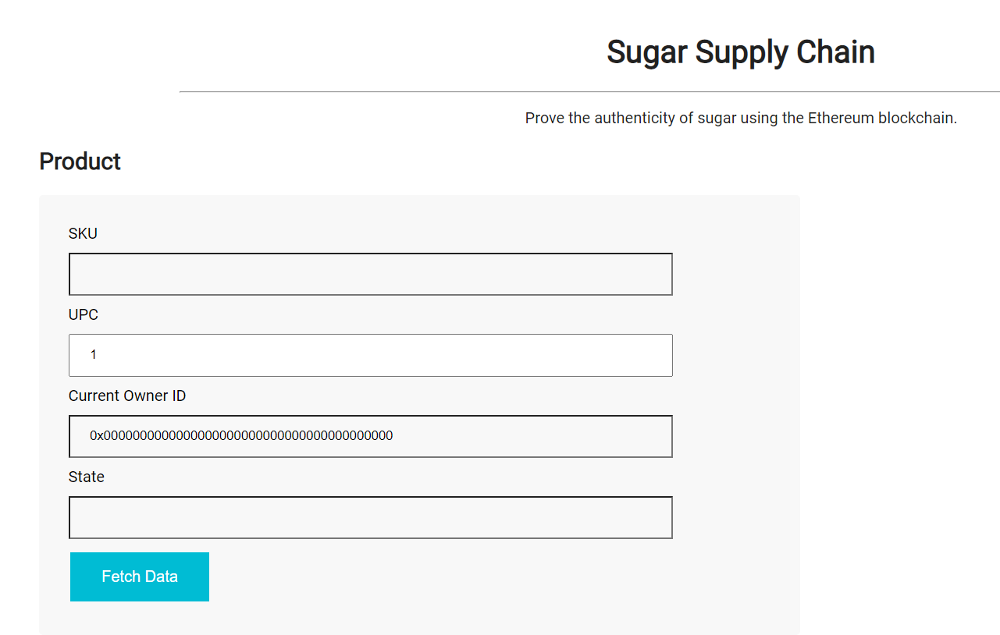
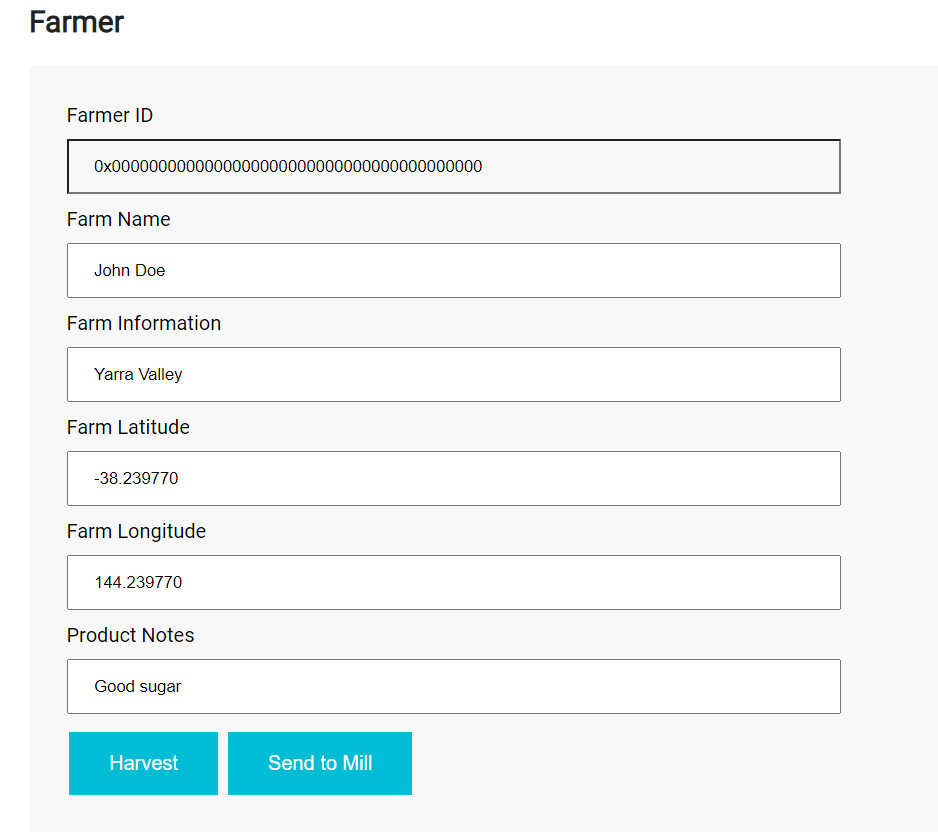
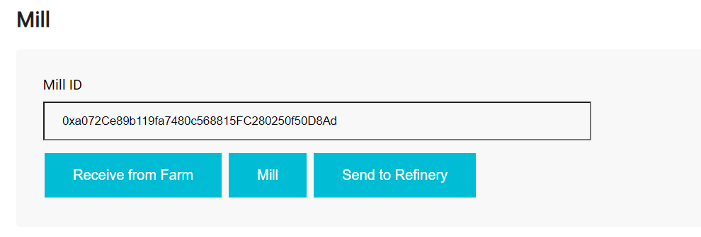
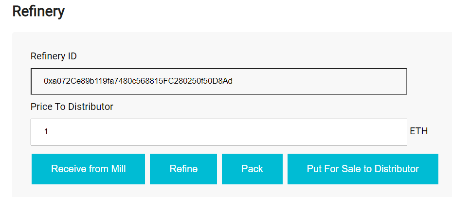
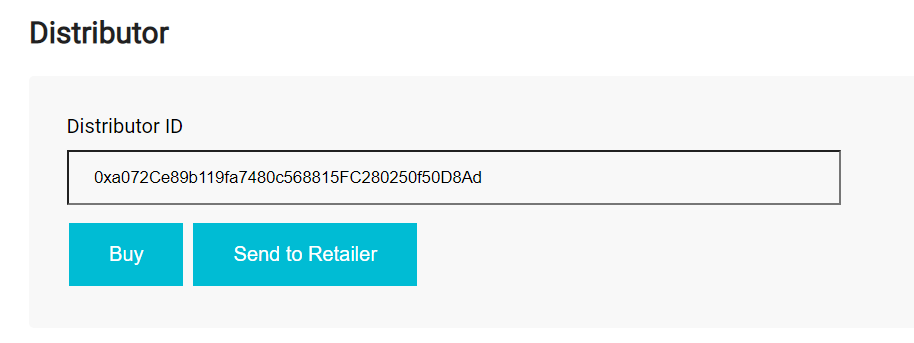
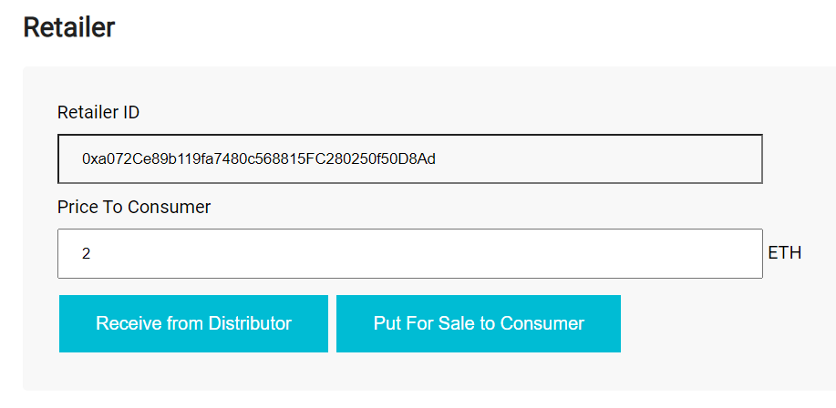
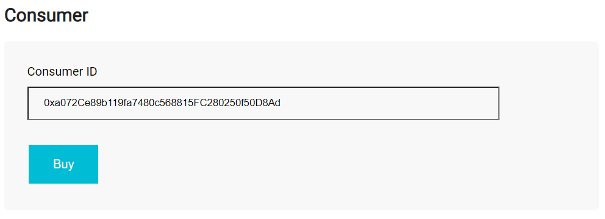
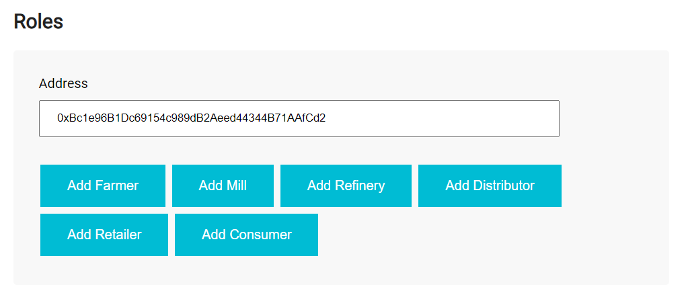

# **Sugar Supply Chain**
An Ethereum Dapp for tracking the authenticity of sugar

***

## **Running the Tests**
To run the test first start a local node

    truffle develop

Then in another terminal run the tests

    truffle test     

***

## **Running the Application**
To deploy the smart contracts run

    truffle develop
    truffle(develop)> migrate

To start the frontend server run

    npm run dev

***

## **Using the Application**
1. Input the UPC and press the fetch data button to get the product information.

2. Input the farm name, farm information, longitude, latitude and product notes, then press the Harvest button to change the product state to harvested.
3. Press the Send to Mill button to change the product state to sent to mill.

4. Press the Receive from Farm to change the product tate to received by mill.
5. Press the Mill button to change the product state to milled.
6. Press the Send to Refinery button to change the product state to send to refinery.

7. Press the Receive from Mill button to change the product state to received by refinery.
8. Press the Refine button to change the product state to refined.
9. Press the Pack button to change the product state to packed.
10. Input the price to distributor and press the Sell to Distributor button to change the product state to for sale to distributor.

11. Press the Buy button to change the product state to bought by distributor. 
12. Press the Send to Retailer button to change the product state to sent to retailer.

13. Press the Receive from Distributor button to change the product state to received by retailer.
14. Input the price to consumer and press the Sell to Consumer button to change the product state to for sale to consumer.

15. Press the Buy button to change the product state to bought by consumer.

16. Input an address and press one of the buttons to add a role to the address.

***

## **Testnet**
* Contract address on Goerli Testnet: 0xb25C0E0300084E7Ac34786B9316ce6d37cdD26EF
* Transaction ID: 0x2144eefb009cca0fb19dbd23e23b49166d6b3eb87aaa01e64636d73cac05e8da

***

## **Libraries**
* [@truffle/contract](https://www.npmjs.com/package/@truffle/contract): used for connecting to the smart contracts in the frontend
* [@truffle/hdwallet-provider](https://www.npmjs.com/package/@truffle/hdwallet-provider): used for connecting to Infura and deploying to the testnet
* [web3](https://www.npmjs.com/package/web3): used for interacting with smart contracts
* [dotenv](https://www.npmjs.com/package/dotenv): used for storing secrets in an .env file

***

## **IPFS**
IPFS is not used in this project

***

## **Versions**
* Node 16.13.2
* Truffle 5.6.9
* Web3 1.8.1